# LLM Wiki Serve

[](https://github.com/knowledge-bridge-labs/llmwiki-serve/actions/workflows/ci.yml)
[](./LICENSE)
[](https://www.python.org/)

`llmwiki-serve` is the read-only Knowledge Source server for the LLMWiki
toolchain. Point it at an existing Markdown, Obsidian-style, or LLMWiki folder
and it exposes the same local projection as CLI commands, HTTP endpoints,
MCP-style JSON-RPC tools, an MCP Streamable HTTP endpoint, and optional
A2A-style compatibility endpoints.

Use it when:

- You want local, agent-readable context from files you already own.
- A coding agent, IDE agent, script, or workbench can retrieve cited evidence
  and do its own planning or answer synthesis.
- You need the source layer that `llmwiki-agent-bridge` and `llmwiki-chat` can
  call.

In the toolchain, `llmwiki-serve` is the first layer: it reads your wiki and
serves evidence. `llmwiki-agent-bridge` is optional answer-synthesis
escalation, and `llmwiki-chat` is the browser workbench for source, graph,
runtime, and trace inspection.

It is not a full-stack RAG app: it does not crawl the web, build a hosted
vector store, run a model, synthesize final answers, or mutate your wiki.

[Examples](examples/README.md)
| [Architecture](docs/architecture.md)
| [OpenAPI contract](docs/openapi.json)
| [Release checklist](docs/release.md)
| [Docs portal](https://knowledge-bridge-labs.github.io/llmwiki-docs/)
| [Release status](https://knowledge-bridge-labs.github.io/llmwiki-docs/status)
| [Contributing](CONTRIBUTING.md)
| [Security](SECURITY.md)
| [Support](SUPPORT.md)
| [Changelog](CHANGELOG.md)

> Public-preview note: PyPI install is available for `llmwiki-serve==0.2.0`.
> Source checkout remains supported for local development and release smoke tests.

## Demo

[Watch the docs demo](https://knowledge-bridge-labs.github.io/llmwiki-docs/demo)
to see `llmwiki-serve` project an already-existing LLMWiki, Markdown, or
Obsidian-style folder as a read-only Knowledge Source.

[](https://knowledge-bridge-labs.github.io/llmwiki-docs/demo)

## 10-Minute Quick Start

Install `uv` and use Python 3.11 or newer:

```bash
uv --version
uv python install 3.11
```

Run the bundled sample wiki from a source checkout:

```bash
git clone https://github.com/knowledge-bridge-labs/llmwiki-serve.git
cd llmwiki-serve
uv sync --extra dev

uv run llmwiki-serve manifest ./examples/sample-wiki
uv run llmwiki-serve query ./examples/sample-wiki "release readiness"
uv run llmwiki-serve serve ./examples/sample-wiki --host 127.0.0.1 --port 8765
```

By default, `serve` writes local request/response debugging events to
`.runtime-logs/llmwiki-serve-io.jsonl`. Use `--io-log off` or
`LLMWIKI_SERVE_IO_LOG=off` to disable it, or pass `--io-log <path>` /
`LLMWIKI_SERVE_IO_LOG=<path>` to choose a different JSONL file.

In another terminal, query the local server:

```bash
curl -s http://127.0.0.1:8765/manifest

curl -s http://127.0.0.1:8765/query \
  -H 'content-type: application/json' \
  -d '{"query":"release readiness","limit":4}'
```

On Windows PowerShell, use `curl.exe` explicitly or `Invoke-RestMethod` with a
PowerShell object body. Plain `curl` may resolve to PowerShell's
`Invoke-WebRequest` alias and handle JSON quoting differently.

You have succeeded when `manifest` returns page/source metadata and `query`
returns a context pack with cited pages from `examples/sample-wiki`. Point the
same commands at your own Markdown folder when you are ready:

```bash
uv run llmwiki-serve query /path/to/wiki-folder "what should an agent know?"
uv run llmwiki-serve serve /path/to/wiki-folder --host 127.0.0.1 --port 8765
```

Generated wiki producers that can atomically update a build marker after
ingest/compile may opt into marker-based freshness checks for long-running
servers:

```bash
uv run llmwiki-serve serve /path/to/wiki-folder \
  --host 127.0.0.1 \
  --port 8765 \
  --producer-manifest .llmwiki-producer-manifest.json
```

Use this only when the producer reliably updates the manifest after every
source-changing build. Without that contract, keep the default strict source
scan or use `--refresh-interval-seconds` when a short visibility delay is
acceptable.

Install the current public-preview CLI from PyPI with one of:

```bash
uv tool install llmwiki-serve
# or
pipx install llmwiki-serve
```

Pin `llmwiki-serve==0.2.0` when you need to reproduce this public-preview
release exactly.

## What It Serves

`llmwiki-serve` is a protocol layer over a local knowledge folder. It builds a
read-only projection from Markdown pages, links, headings, tags, front matter,
source references, and optional sidecar graph facts.

| Need | What `llmwiki-serve` provides |
| --- | --- |
| Give an agent grounded context | Query-ranked context packs with orientation pages, citation evidence, limitations, and graph hints. |
| Inspect a wiki without changing it | Manifest, search, read, and graph projections rebuilt from files on disk. |
| Use one source across tools | CLI commands, HTTP endpoints, MCP-style JSON-RPC tools, MCP Streamable HTTP tools, and opt-in A2A-style compatibility endpoints over the same service model. |
| Keep drafts out of agent context | Draft and unpublished pages are withheld by default from context, search, read, and graph responses. |
| Stay local first | Local-only CORS defaults, network manifest path redaction, and no hosted storage requirement. |

Use it for Obsidian, Logseq, Foam, Dendron, Quartz, native LLMWiki folders, and
generated Markdown knowledge bases that fit the documented folder contract.

Do not use it as a wiki compiler, crawler, authoring tool, hosted RAG
application, vector database, model runtime, answer synthesizer, or certified
MCP/A2A implementation.

## How It Fits

```mermaid
flowchart LR
  wiki["existing Markdown or LLMWiki folder"]
  serve["llmwiki-serve<br/>read-only Knowledge Source"]
  direct["Codex / Claude Code / Copilot<br/>direct context use"]
  bridge["llmwiki-agent-bridge<br/>runtime synthesis escalation"]
  chat["llmwiki-chat<br/>graph and trace workbench"]

  wiki --> serve
  serve --> direct
  serve --> bridge
  serve --> chat
```



| Path | Best when | Relationship |
| --- | --- | --- |
| Direct agent use | Codex, Claude Code, Copilot, an IDE agent, or a script needs local wiki context while it performs its own task. | Start here. The agent calls `llmwiki-serve` for evidence and keeps control of planning, edits, or responses. |
| `llmwiki-agent-bridge` | A runtime needs one endpoint that gathers source evidence and returns model-backed, cited answers. | Escalate from direct context calls when answer synthesis belongs in a bridge service. |
| `llmwiki-chat` | A human wants a browser workbench for connected sources, graph context, runtime choices, and traces. | Escalate from server APIs when inspection, routing, and review need a UI. |
| `llmwiki-docs` | You need the cross-repo quickstart, protocol map, deployment posture, and compatibility notes. | Documentation portal prepared for the public preview. |

## Direct Agent Skill

Coding agents can use `llmwiki-serve` directly when a trusted local server is
already running. Set the server URL in your project instructions or local
environment:

```bash
export LLMWIKI_SERVE_URL=http://127.0.0.1:8765
```

Then instruct Codex, Claude Code, Copilot, or another local client to:

1. Call `POST /query` first for the task-specific context pack.
2. Use `/search`, `/read/{page_id}`, `/graph`, `/graph/neighborhood`, `/mcp`,
   or `/mcp/stream` only for follow-up inspection.
3. Treat returned pages as source evidence, not as generated final answers.

Do not hard-code private hosts, ports, credentials, or bearer tokens in
committed agent instructions. Reusable Codex, Claude Code, and Copilot direct
client examples live in the `llmwiki-agent-bridge` repository under
`integrations/`; after public transfer, start with
`https://github.com/knowledge-bridge-labs/llmwiki-agent-bridge/tree/main/integrations`.
In local sibling checkouts, use `../llmwiki-agent-bridge/integrations/README.md`.

Escalate to `llmwiki-agent-bridge` when the agent should call a single
model-backed answer endpoint instead of managing source retrieval itself.
Escalate to `llmwiki-chat` when a human needs to inspect graph context,
runtime selection, traces, and cited answers interactively.

## Serving Surface

All entry points use the same read-only service behavior.

| Surface | Shape |
| --- | --- |
| CLI | `manifest`, `query`, `source-refs`, `source-bundle`, and `serve`. |
| HTTP | `GET /health`, `GET /manifest`, `GET /source-bundle`, `GET /source-refs`, `POST /query`, `POST /search`, `GET /read/{page_id}`, `GET /graph`, `GET /graph/neighborhood`. |
| MCP-style JSON-RPC | `POST /mcp` with `tools/list` and `tools/call` for `llmwiki_context`, `llmwiki_search`, `llmwiki_read`, `llmwiki_graph`, `llmwiki_graph_neighbors`, `llmwiki_source_refs`, and `llmwiki_source_bundle`. |
| MCP Streamable HTTP | `POST /mcp/stream` using the official MCP Python SDK FastMCP Streamable HTTP transport for the same seven tools. |
| A2A-style compatibility | Off by default. Enable `GET /.well-known/agent-card.json` and `POST /message:send` with `llmwiki-serve serve --enable-a2a-compat` or `create_app(..., enable_a2a_compat=True)`. |

`GET /health` is the lightweight readiness and discovery document for
connection setup. It identifies the service as `llmwiki-serve`, reports the
current source id, bundle id, projection counts, protocol endpoints,
capabilities, and CORS mode without exposing the local source root or literal
configured CORS origin values.

Agents should call `llmwiki_context` first for a single grounded question.
Agents that coordinate host-owned RAG or multi-source orchestration should also
inspect `llmwiki_source_bundle` to discover the stable source identity,
projection signature, raw-origin metadata, and opaque source references.
Search, read, graph, and source-ref tools are follow-up tools for focused
inspection.

For CKG-like graph-guided retrieval, agents can call `GET /graph/neighborhood`
or MCP `llmwiki_graph_neighbors` after `/query` or `llmwiki_context` points to a
relevant page, source reference, tag, or sidecar graph node. Neighborhood lookup
returns a bounded subgraph around supplied seed values with optional direction,
depth, and relation filters. It is a compact inspection primitive, not a CKG
standard conformance claim and not a replacement for search or exact reads.

The generated FastAPI OpenAPI contract is committed at
[docs/openapi.json](docs/openapi.json). It covers the default HTTP and
MCP-style JSON-RPC compatibility surface; the mounted MCP Streamable HTTP ASGI
app is served at runtime, and A2A-style schemas are available only when the app
is created with A2A compatibility enabled.

## What It Reads

- Generic Markdown wikis with `hot.md`, `index.md`, `overview.md`, and topic
  pages.
- Obsidian-style wikilinks such as `[[Process Page]]` and Markdown links to
  other `.md` pages.
- YAML front matter fields such as `id`, `title`, `status`, `review_state`,
  `source_refs`, `tags`, and `updated_at`.
- Folder-level graph structure from pages, headings, links, tags, and source
  references.
- Optional sidecar graph facts from `graph/graph.json`.
- Source-bundle metadata that identifies one served knowledge source, its
  current projection signature, visible source refs, and metadata-only raw-origin
  hints. Raw files remain owned by the operator or host RAG layer; `llmwiki-serve`
  does not read or expose arbitrary binary source content.

Named producer repositories in the architecture guide are compatible Markdown
output targets, not endorsed integrations or per-release support claims.
`llmwiki-serve` reads their generated or stored Markdown when it matches the
native folder contract or a supported adapter shape.

## Compared With

| Compared with | Difference |
| --- | --- |
| Full-stack RAG app | `llmwiki-serve` does not own ingestion jobs, embeddings, model calls, chat UX, auth, or hosting. It serves local files as context and protocol-shaped APIs. |
| Vector database | No embedding index or remote storage is required. Ranking is over the current read-only Markdown projection. |
| Wiki compiler or crawler | It does not generate, crawl, normalize, migrate, or rewrite source Markdown. |
| MCP/A2A implementation | It exposes an official-SDK MCP Streamable HTTP endpoint plus compatibility-test JSON-RPC and opt-in A2A-style surfaces, but does not claim A2A certification or exhaustive runtime feature completeness. |
| `llmwiki-agent-bridge` | The bridge is the model/runtime escalation layer. `llmwiki-serve` remains the source projection layer underneath it. |
| `llmwiki-chat` | Chat is the browser workbench. `llmwiki-serve` is the local API surface it can inspect or call. |

## Python API

The documented Python import surface is:

```python
from llmwiki_serve import LlmWikiService, create_app
```

`LlmWikiService` owns manifest, source-bundle, source-ref, context, search,
read, graph, and refresh behavior. `create_app` builds the FastAPI app for
embedding the HTTP, MCP-style JSON-RPC, MCP Streamable HTTP, and optional
A2A-style compatibility surfaces. Other package modules are implementation
details unless documented here.

## Safety Defaults

- The selected source folder is immutable input. No source Markdown is
  rewritten, normalized, migrated, annotated, or uploaded by the server.
- CLI `manifest` and `query` build a fresh projection for each process.
  Long-running `serve` instances cache an in-memory projection and refresh it on
  the next request when Markdown, Org, adapter marker/config, or
  `graph/graph.json` source files change. By default this freshness check runs
  before each request. Operators can opt into
  `--refresh-interval-seconds <seconds>` to reuse the current in-memory
  projection between checks for larger local graphs where a short visibility
  delay is acceptable.
- Long-running `serve` instances can use `--producer-manifest <path>` as an
  explicit freshness contract for generated wiki outputs. When the configured
  non-symlink manifest file exists inside the served root, the server checks
  that marker instead of digesting every source file on each request. If source
  files change but the producer manifest does not, the cached projection may be
  reused. If the manifest is missing or unsafe, the server falls back to normal
  source scanning. The marker is not the public projection identity:
  `projection.signature` and `bundle_id` remain content-derived from
  projection-affecting source files and are recomputed on initial load and
  marker changes.
- Production deployments that need projection reuse across worker processes can
  install `llmwiki-serve[redis]` and start `serve` with
  `--projection-store redis --redis-url redis://...`. Redis/Valkey stores
  derived projection artifacts only; Markdown folders and graph sidecars remain
  the source of truth. Use `--source-id` and `--cache-namespace` to keep shared
  Redis deployments collision-free. Treat Redis as sensitive storage: cached
  projections may include derived page text and front matter, including draft
  pages that are still filtered from network responses by the serving layer.
- Draft and unpublished pages are withheld by default from read, search,
  context, and graph responses. Visibility blocks explicit non-serving markers:
  `draft: true`, `published: false`, `publish: false`,
  draft/proposed/needs_review `review_state` values, and `status` values such
  as `draft`, `proposed`, `needs_review`, `blocked`, `unpublished`, `private`,
  `hidden`, `embargoed`, `confidential`, `internal`, or `withheld`. Other
  lifecycle or maturity `status` values are served by default. HTTP and MCP
  tool `include_drafts=true` is honored only when `--allow-drafts` or
  `create_app(..., allow_drafts=True)` is used. A2A-style compatibility
  endpoints are disabled by default; when enabled, `message:send` always builds
  approved-only context.
- Network manifest responses omit the local wiki root path. The CLI manifest is
  local operator output and includes the root path.
- Long-running `serve` instances write local I/O debugging events by default to
  `.runtime-logs/llmwiki-serve-io.jsonl`. Events include method, path, status,
  duration, selected request bodies for `/query`, `/mcp`, `/mcp/stream`, and
  `/message:send`, and bounded response bodies. Authorization, cookies, tokens,
  credentials, API keys, common secret shapes, and the served local root are
  redacted. Use `--io-log off` or `LLMWIKI_SERVE_IO_LOG=off` to opt out.
- The default HTTP CORS policy allows local browser origins on `localhost`,
  `127.0.0.1`, and IPv6 localhost `[::1]`; it is not a wildcard. Explicit
  `--cors-origin` values replace the default local allowlist.
- Symlinked Markdown/Org source files, symlinked adapter marker/config files,
  and symlinked `graph/graph.json` sidecars are ignored by default so the served
  source tree stays within the selected wiki root.

Review [SECURITY.md](SECURITY.md) before exposing a wiki beyond a trusted local
environment. Use [SUPPORT.md](SUPPORT.md) for issue routing and compatibility
report expectations.

## Optional Redis/Valkey Projection Cache

Most users should start without Redis:

```bash
pip install llmwiki-serve
llmwiki-serve serve ./wiki --host 127.0.0.1 --port 8765
```

Use Redis or Valkey only when a long-running deployment needs to reuse the same
derived projection across worker processes, cold restarts, or repeated service
instances. Redis does not make source queries semantically smarter, does not
replace file freshness checks, is not the source of truth, and does not store
conversation history, orchestration state, or model prompt caches.

Install the optional extra and pass an explicit namespace and source id for
shared deployments:

```bash
pip install "llmwiki-serve[redis]"
llmwiki-serve serve ./wiki \
  --projection-store redis \
  --redis-url redis://127.0.0.1:6379/0 \
  --cache-namespace acme-prod \
  --source-id project-alpha \
  --redis-failure-policy fail-fast
```

Environment variables are available for process managers and containers:

```text
LLMWIKI_PROJECTION_STORE=redis
LLMWIKI_REDIS_URL=redis://127.0.0.1:6379/0
LLMWIKI_CACHE_NAMESPACE=acme-prod
LLMWIKI_SOURCE_ID=project-alpha
```

Failure policy is CLI-only, so add it to the server start command when using
environment-based Redis configuration:

```bash
llmwiki-serve serve ./wiki --redis-failure-policy fail-fast
```

`--redis-failure-policy fallback-local` is the default and keeps serving from
process memory after a Redis client failure. Use `fail-fast` when production
operators require shared-cache availability and want misconfiguration or Redis
outages to stop the server.

For local Docker validation, use a non-sensitive fixture and an isolated
namespace:

```bash
docker run -d --rm --name llmwiki-projection-cache \
  -p 127.0.0.1:6379:6379 \
  valkey/valkey:8
LLMWIKI_REDIS_URL=redis://127.0.0.1:6379/0 \
  uv run pytest -q tests/test_redis_projection_store_integration.py
docker stop llmwiki-projection-cache
```

For managed Redis or Valkey, use network isolation, authentication, TLS where
available, deployment secrets for URLs, and deployment-specific namespaces. Do
not point a public or shared untrusted Redis instance at private wiki content.

Redis payloads are sensitive derived storage. Cached projections can include
page text, front matter, source refs, graph metadata, and draft pages that
normal network responses still withhold. The current implementation keys
records by projection signature and does not apply an automatic TTL. If content
is deleted, renamed, or reclassified from draft/private to another state,
operators should use Redis eviction/TTL policy, rotate `--cache-namespace`, or
perform namespace cleanup during maintenance. Do not paste Redis URLs,
credentials, raw keys, cached values, or private snippets into release notes,
issues, or diagnostics screenshots.

`llmwiki-agent-bridge`, `llmwiki-chat`, Hermes, DeepAgents, and host agents own
runtime prompt, history, and prefix-cache behavior. Keep those caches in the
runtime, bridge, or workbench layer; `llmwiki-serve[redis]` only caches the
read-only source projection.

## Repository Structure

| Path | Purpose |
| --- | --- |
| `src/llmwiki_serve/` | Service, parser, projection, API, and CLI implementation. |
| `examples/` | Public sample wiki and example usage notes. |
| `docs/` | Architecture, OpenAPI contract, and release guidance for source-checkout users. |
| `scripts/` | Release smoke and candidate-sample helper scripts. |
| `tests/` | Unit tests, adapter fixtures, and compatibility smoke coverage. |
| `pyproject.toml`, `uv.lock` | Python package metadata and locked development environment. |

## Project Posture

`llmwiki-serve` is independent community tooling for LLM Wiki-style Markdown
knowledge folders. It is Apache-2.0 licensed and is not an official project from
Andrej Karpathy or any upstream producer named in compatibility examples.

This repository is in public preview. PyPI install is available for
`llmwiki-serve==0.2.0`, and source checkout remains supported for local
development and release smoke tests. Use the hosted docs and Release Status &
Compatibility matrix for the current package and protocol posture.

The current protocol surface is HTTP plus MCP-style JSON-RPC, MCP Streamable
HTTP, and opt-in A2A-style message shapes. The Streamable HTTP endpoint uses the
official MCP Python SDK FastMCP transport; the compatibility endpoints are local
agent and harness surfaces, not a claim of A2A certification, exhaustive runtime
feature completeness, or upstream producer certification.

## Validation

For a quick source-checkout smoke:

```bash
uv run python scripts/check_third_party_notices.py
uv run python scripts/export_openapi.py --check
uv run python scripts/release_smoke.py
```

For a release-oriented local gate:

```bash
uv run ruff format --check .
uv run ruff check .
uv run mypy src
uv run pytest -q
uv build
uv run python scripts/release_smoke.py --wheel dist/*.whl --sdist dist/*.tar.gz
```

The release smoke checks the bundled sample wiki through CLI, HTTP,
MCP-style JSON-RPC, MCP Streamable HTTP, and opt-in A2A-style message shapes,
including draft filtering, local-only CORS, MCP error redaction, source
immutability, source distribution contents, OpenAPI contract freshness, and
packaged wheel CLI installation.

Optional validation paths are documented in [docs/release.md](docs/release.md):
real local-server curl checks, pinned public upstream sample snapshot smoke, and
generated candidate sample artifacts. These are compatibility probes for the
current serving contract. They do not certify upstream producer versions, full
MCP/A2A protocol support, private wiki safety, live network deployment,
authentication, TLS, or every application-specific
Obsidian/Logseq/Foam/Dendron/Quartz feature.

## Project Documents

- [Docs portal](https://knowledge-bridge-labs.github.io/llmwiki-docs/)
- [Release Status & Compatibility](https://knowledge-bridge-labs.github.io/llmwiki-docs/status)
- [Architecture](docs/architecture.md)
- [Examples](examples/README.md)
- [Release checklist](docs/release.md)
- [Contributing](CONTRIBUTING.md)
- [Security](SECURITY.md)
- [Support](SUPPORT.md)
- [Code of Conduct](CODE_OF_CONDUCT.md)
- [Changelog](CHANGELOG.md)

## License

Apache-2.0. See [LICENSE](LICENSE).
